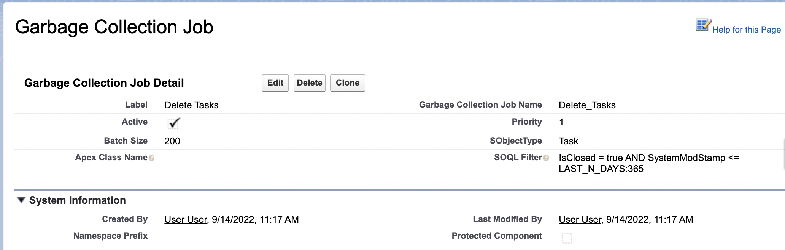
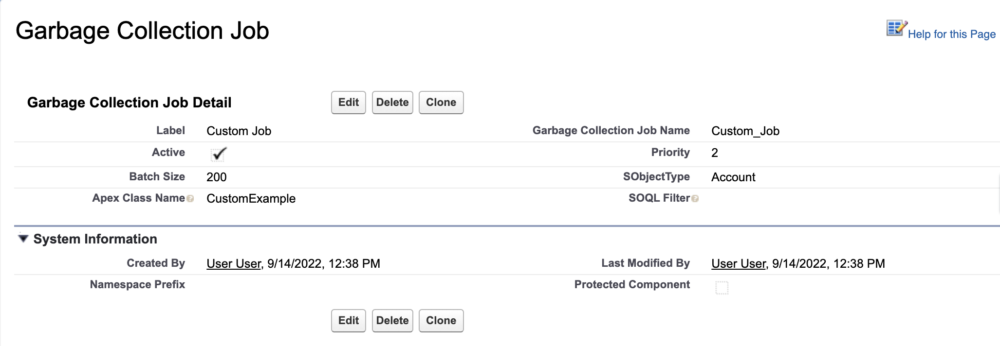

# GarbageCollector

> "You can never have too much information..."

That's what I thought until early on in my career, when my company came under pressure from Salesforce because we exceeded our [Data and File Storage Allocation](https://help.salesforce.com/s/articleView?id=sf.overview_storage.htm&type=5&language=en_US).

Under closer scrutiny, it turns out that _really old_ data wasn't actually all that helpful. In some cases, it can be actively determintal. Could you imagine if some personal data from ten years ago was exposed as part of a data breach?

In response, we implemented a [data retention policy](https://en.wikipedia.org/wiki/Data_retention) that defined how long we should keep "stale" data live in Salesforce. As a result, we wrote a number of jobs that looked something like this:

```
public class Example implements Database.Batchable<Example__c> {
    public Database.QueryLocator start(
        Database.BatchableContext ctx
    ) {
        return Database.getQueryLocator([
            SELECT Id
            FROM Example__c
            WHERE SystemModStamp <= LAST_N_DAYS:365
        ]);
    }

    public void execute(Database.BatchableContext ctx, List<Example__c> scope) {
        Database.delete(scope, false);
    }
}
```

While this works, there are some flaws with this approach:

-   Not resistent to change. Any minor amendment to the data retention policy would require a code change, and all of the extra overhead that comes with it.
-   Repetitivity. Imagine implementing slightly different versions of this class (and corresponding test classes) twenty or more times.

Introducing `GarbageCollector` - a metadata driven solution to data storage problems. **GarbageCollector** provides a way to quickly create batch jobs to handle stale data. Simple jobs - like the example above, can be created or modified in metadata, without touching a single line of code. The framework can be easily extended to handle more complex use cases.

## Creating a Scheduled Job

**GarbageCollector** is designed to run inside of a scheduled job. Developers can create regular instances of `GarbageScheduler` in the [Setup UI](https://help.salesforce.com/s/articleView?id=sf.code_schedule_batch_apex.htm&type=5). For finer control, Developers can call `System.schedule()` in an anonymous script, like the one below:

```
// Creates a job to run daily at midnight
final String CRON_EXP = '0 0 0 * * ?';
final String jobName = 'Garbage Collection';
System.schedule(jobName, CRON_EXP, new GarbageScheduler());
```

Read more about Scheduling Apex Jobs [here](https://trailhead.salesforce.com/content/learn/modules/asynchronous_apex/async_apex_scheduled).

## Custom Metadata Control

The `Garbage_Collection_Job__mdt` custom metadata object gives developers declarative control over the framework. Each record represents a single job that will be run during each run of `GarbageScheduler`.

**Fields**:

-   `Active`: Controls whether the job will be run in `GarbageScheduler`.
-   `Priority`: A unique number that determines the order that jobs are run in.
-   `Batch Size`: Determines batch size of the resulting `GarbageCollector` batch job. This defaults to 200. You may increase the size to reduce the number of batches (for extremely large jobs), or decrease it to avoid CPU timeouts.
-   `SObjectType`: The `FROM` SObject in the batch query.
-   `Apex Class Name`: The name of the custom Apex Class to be run. One of this field, or `SOQL Filter` **must** be populated. This class must extend the `GarbageCollector` base class. See [Custom Jobs](#CustomJobs) for more.
-   `SOQL Filter`: The SOQL `WHERE` clause(s) to be applied in the batch query. One of this field, or `Apex Class Name` **must** be populated.

## Adding Batches to the Job

### **SOQL-driven Delete Jobs**

Developers can add simple, SOQL-driven deletion jobs without writing a single line of code. To do this, create a `Garbage Collection Job` record, and populate the `SOQL Filter` field:


For each of these _SOQL-driven jobs_, `GarbageScheduler` will create a new instance of the `GarbageCollectorSoql` class. This class will construct a batch query using the `Garbage Collection Job` record's `SObjectType` and `SOQL Filter` values, and then delete any records that the query returns.

> **Important**: Always test your metadata changes in a sandbox environment first.

### **Custom Jobs**

While _SOQL-driven jobs_ will cover most use cases, some jobs may require more control. For this, developers can define their own logic in a custom class. Custom classes must:

-   Extend the `GarbageCollector` abstract class
-   Expose a global or public default constructor.

Once the class is created, remember to create a `Garbage Collection Job` record which references your class:



See the following example use cases to gain inspiration for your own custom jobs:

#### **Use Case: Archiving**

Some organizations may use a third-party service to archive data, instead of deleting it altogether. Developers can accomplish this by creating a new job which overrides `GarbageCollector`'s virtual `execute()` method:

```
public class ArchiveExample extends GarbageCollector {
    public override Database.QueryLocator(
        Database.BatchableContext ctx
    ) {
        return Database.getQueryLocator([
            SELECT Id
            FROM Task
            WHERE SystemModStamp <= LAST_N_DAYS:365
        ]);
    }

    public override void execute(
        Database.BatchableContext ctx,
        List<Task> scope
    ) {
        HttpRequest request = new HttpRequest();
        request.setBody(JSON.serialize(scope));
        request.setEndpoint('callout:Archive_Service/Tasks');
        request.setMethod('POST');
        HttpResponse response;
        try {
            response = new Http().send(request);
        } catch (System.CalloutException error) {
            Logger.error('ArchiveExample failed: ' + error);
            Logger.publish();
            throw calloutError;
        }
        if (response?.getStatusCode() == 200) {
            DatabaseLayer.Dml.doDelete(scope, false);
        } else {
            Logger.error(
                'ArchiveExample failed: ' +
                response?.getStatusCode() + ': ' +
                response?.getBody()
            );
            Logger.publish();
        }
    }
}
```

#### **Use Case: Complex queries**

A _SOQL-driven job_ is limited to basic, vanilla SOQL. The query cannot utilize any advanced Apex features, such as bind variables.

This query, which searches for records owned by a particular user is valid in Apex:

```
List<SObject> records = [
    SELECT Id
    FROM Account
    WHERE OwnerId = :Label.HoldingUserId
];
```

...but it is not valid as-is in dynamic SOQL:

```
String dynamicSoql = 'SELECT Id FROM Account WHERE OwnerId = :Label.HoldingUserId';
List<SObject> records = Database.query(dynamicSoql);
// ! Error: System.QueryException: Variable does not exist: Label.HoldingUserId
```

To implement this, you would create a custom class which overrides the GarbageCollector's `start()` method to return a custom query:

```
public class AdvancedSoqlExample extends GarbageCollector {
    public override Database.QueryLocator start(
        Database.BatchableContext context
    ) {
        return Database.QueryLocator([
            SELECT Id
            FROM Account
            WHERE OwnerId = :Label.HoldingUserId
        ]);
    }
}
```
