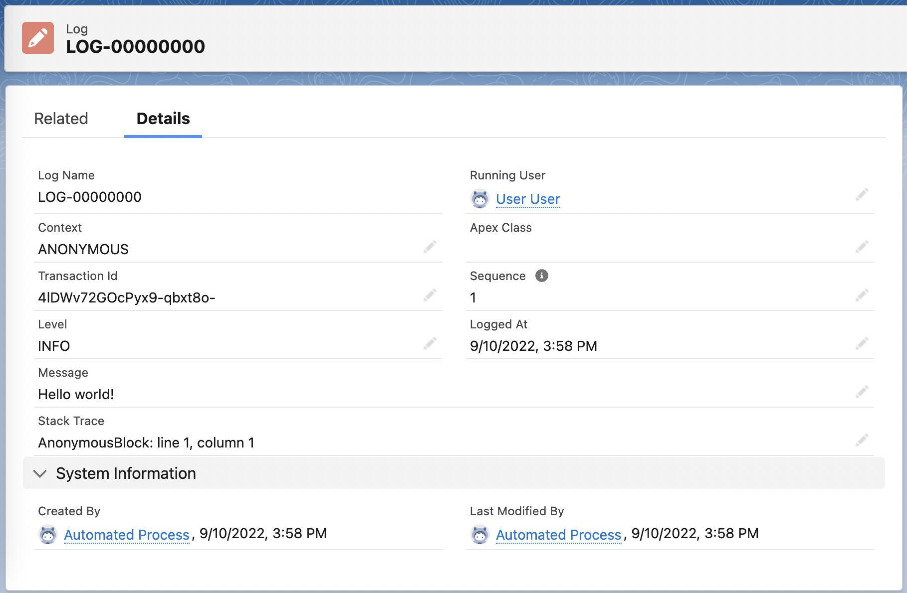
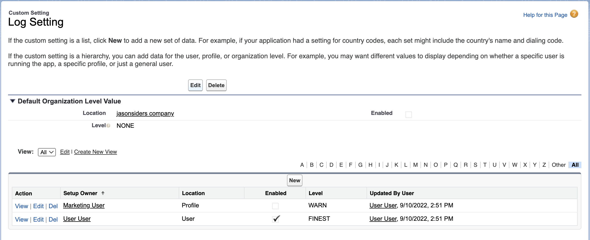
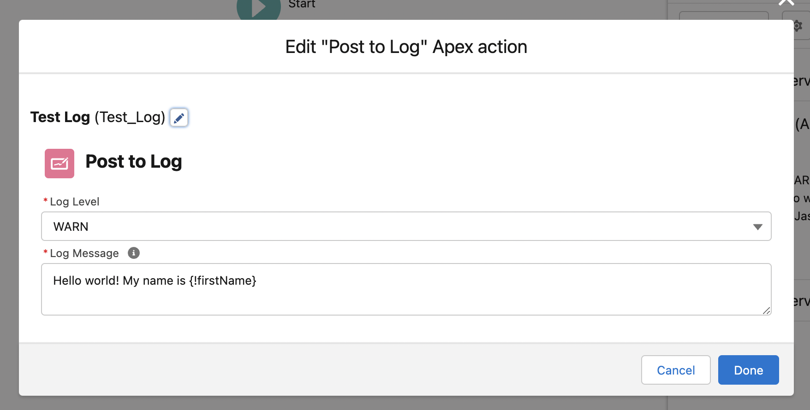
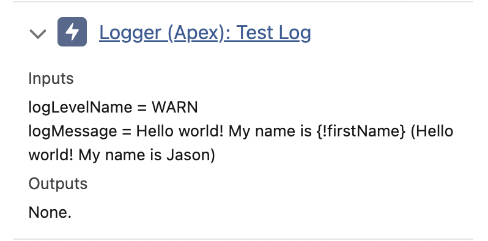

# Logger

`Logger` is a lightweight, intuitive logging framework. Logger can be used to produce actionable insights without the overhead of traditional debug logs.

Developers can use `Logger` in place of `System.debug` statements throughout their codebase. Using `Logger` will print information to traditional Apex debug logs, and also generate custom `Log__c` records. These records are reportable, and can be easily filtered by class, running user, type, transaction, and more.

## The Log SObject

The `Log__c` SObject stores details of individual log messages in Salesforce. These include a number of contextual details that can aid developers in troubleshooting, including:

-   `Context`: The `Quiddity`, or execution context which generated the log (ex., `BATCH_APEX`). Read more about `Quiddity` [here](https://developer.salesforce.com/docs/atlas.en-us.Apexref.meta/Apexref/Apex_enum_System_Quiddity.htm).
-   `Level`: The severity of the log message. This corresponds with the `LoggingLevel` enum. Read more about `LoggingLevel` [here](https://developer.salesforce.com/docs/atlas.en-us.Apexref.meta/Apexref/Apex_enum_System_LoggingLevel.htm).
-   `Logged At`: The DateTime that the log statement was generated. This differs from the Log's `CreatedDate`.
-   `Message`: The body of the log message.
-   `Running User`: The Salesforce User which generated the log. Since `Log__c` records are inserted via platform event, `CreatedById` will always be the _Automated Process_ user.
-   `Sequence`: The numerical order in which the log message was inserted in a transaction, beginning with 1. For example:

```
Logger.log('Sequence will be 1');
Logger.log('Sequence will be 2');
Logger.log('Sequence will be 3');
```

-   `Stack Trace`: Details the exact stack trace which led to the log statement. This excludes any internal `Logger` stack details.
-   `Transaction Id`: Includes the unique Salesforce Id for the given transaction.

> **Note:** Apex does not print stack traces in a managed package context. For this reason, if `Logger` is used in managed packages, the `Stack Trace` field will always be blank. As a workaround, package developers can populate `Log__c.Apex_Class__c` by passing the current Apex Class type as an optional parameter in `Logger.log()`:

Here's an example log record:



## Configuration

Configuring `Logger` should be familiar to anyone who has used traditional Salesforce debug logs in the past.

Logger uses a Custom Setting object (`Log_Setting__c`) to define who can generate Log records, and what types of log messages will be captured. `Log_Setting__c` includes the following fields:

-   `Enabled`: A checkbox field which determines if Logs are enabled for the defined entity.
-   `Level`: A text field which defines the minimum `LoggingLevel` threshold required for log messages to post.

> **Note:** Custom Settings do not support picklists. The developer must to ensure an appropriate `LoggingLevel` value is entered into the `Level` field. Logger will treat any invalid values as `LoggingLevel.NONE`, and no logs will be generated. Read more about `LoggingLevel` [here](https://developer.salesforce.com/docs/atlas.en-us.Apexref.meta/Apexref/Apex_enum_System_LoggingLevel.htm).

Like all hierachial Custom Settings, you can define Log Settings for a specific User, a specific Profile, or the default settings for the entire Organization via the `Location` field.



## Usage

### **In Apex**

Call `Logger.log()` to register log messages. These messages will also print to traditional Apex debug logs. Log messages are initially considered "pending", and are not committed to the database until `Logger.publish()` is called:

```
// This example will publish 200 log messages using a single publish call
for (Integer i = 0; i < 200; i++) {
    // Create a "pending" log
    Logger.log('Test message #' + (i + 1));
}
// Insert all "pending" logs
Logger.publish();
```

`Logger.log()` accepts a `LoggingLevel` enum value to define the severity of the given log message. Developers can also use one of the shorthand overrides which reference the `LoggingLevel` in the method name:

```
Logger.log(LoggingLevel.FINEST, 'This is FINEST');
Logger.finest('Also FINEST');
```

The `LoggingLevel` value and the running user's `Log_Setting__c.Level__c` determine whether the log message will be posted. This can be used to ensure that only relevant details are surfaced at any given time:

```
// When set to INFO, all messages set to INFO or more severe will be logged
Log_Setting__c mySettings = Log_Setting__c.getInstance();
mySetting.Level__c = LoggingLevel.INFO.name();
update mySetting;

Logger.finest('This will not post');
Logger.info('This will post');
Logger.error('This will post');
```

Logger uses platform events to insert `Log__c` records. This means that `Logger.publish()` will commit all "pending" logs to the database, even if an exception terminates the transaction later:

```
Logger.log('This will post!');
Logger.publish();
Logger.log('This will not...');
throw new CustomException(); // This will kill the transaction
```

### **In Flow**

Developers can use the `Post to Log` action to post log messages from within Flow. This action supports the use of Flow variables in merge fields:





> **Note:** Each _invocation_ of the flow action will incur one `EventBus.publish()` call. Salesforce's Flow Engine groups `@InvocableMethod` method inputs into a single call per transaction.

### **In External Services**

Developers can write log messages in Logger from external services, via a `POST` call to `/services/apexrest/log`

```
{
    "logLevelName": "FINEST",
    "logMessage": "Hello world!"
}
```

-   `logLevelName` (String): A `LoggingLevel` enum value which defines the log message's severity level. See all possible values [here](https://developer.salesforce.com/docs/atlas.en-us.Apexref.meta/Apexref/Apex_enum_System_LoggingLevel.htm).
-   `logMessage` (String): The desired log message.

The API will return one of the following responses:

-   `200`: (Success): No body
-   `500`: (Error): Sample body below:

```
{
    "message": "System.UnknownException: Error details here"
}
```

## Considerations

### **Data Storage**

If published, each log message will create a `Log__c` record. If left unchecked, a large number of records will be generated and count against Organization storage limits. Read more about these limits [here](https://help.salesforce.com/s/articleView?id=sf.overview_storage.htm&type=5).

Developers should use the following strategies to reduce storage impact:

#### 1. **Only Enable When Needed**

Developers can enable or disable logging for specific Salesforce Users or Profiles via the `Log_Setting__c` Custom Setting object. Developers can also define default Log Settings for the entire Organization. It is recommended that the Organization Default `Log_Setting__c` always have the `Enabled` field set to false (unchecked).

It is recommended that you enable debug logs for as few people as necessary, and for as little time as required. Once logs are no longer needed, developers may disable them by unchecking the appropriate Log Setting's `Enabled` field.

#### 2. **Assign Appropriate Log Levels**

The `LoggingLevel` enum is used to control the granularity of log messages that will be published. You must choose an appropriate `LoggingLevel` when writing log messages with Logger.

-   Critical information (ex., error details) should have a higher priority `LoggingLevel`, like `ERROR`, `WARN`.
-   Medium priotity information (ex., API Request/Response bodies) should have a medium priority `LoggingLevel`, like `DEBUG` or `INFO`.
-   Low priority information (ex., code performance metrics) should have a low priority `LoggingLevel`, like `FINE`, `FINER`, or `FINEST`.

Similarly, when enabling logs via the Log Setting, you should choose the appropriate `Level` so that only the details you need to see will be logged.

#### 3. **Consider Garbage Collection**

While logs can be incredibly useful, they not typically kept for a long period of time. Developers can use the included `GarbageCollector` framework to automatically delete `Log__c` records after a defined period of time (ex., 30 days). Read more about the `GarbageCollector` framework [here](../GarbageCollection/README.md).

### **Platform Event Limits**

Each `Logger.publish()` call incurs an `EventBus.publish()` call against Organization limits. This includes the `Post to Log` flow action and `/services/apexrest/log`. Read more about these limits [here](https://developer.salesforce.com/docs/atlas.en-us.234.0.platform_events.meta/platform_events/platform_event_limits.htm).

To reduce Logger's impact against these limits, Developers should minimize `Logger.publish()` calls, as shown below:

```
try {
    Logger.log('Trying something!');
    MyClass.doSomething();
    Logger.log('We did it!');
} catch (Exception error) {
    Logger.log(LoggingLevel.ERROR, 'Uh oh! ' + error);
}
// Why publish 3x when we can do it once here?
Logger.publish();
```

### **Testing**

Custom Settings data is not available in `@IsTest` context by default. Developers can ensure their log statements are visible in tests by inserting a `Log_Setting__c` record as part of the `@TestSetup` process. For example:

```
@TestSetup
static void setup() {
    insert new Log_Setting__c(
        Enabled__c = true,
        Level__c = LoggingLevel.FINEST.name(),
        SetupOwnerId = UserInfo.getOrganizationId()
    );
    // Perform other setup tasks as needed
}
```
