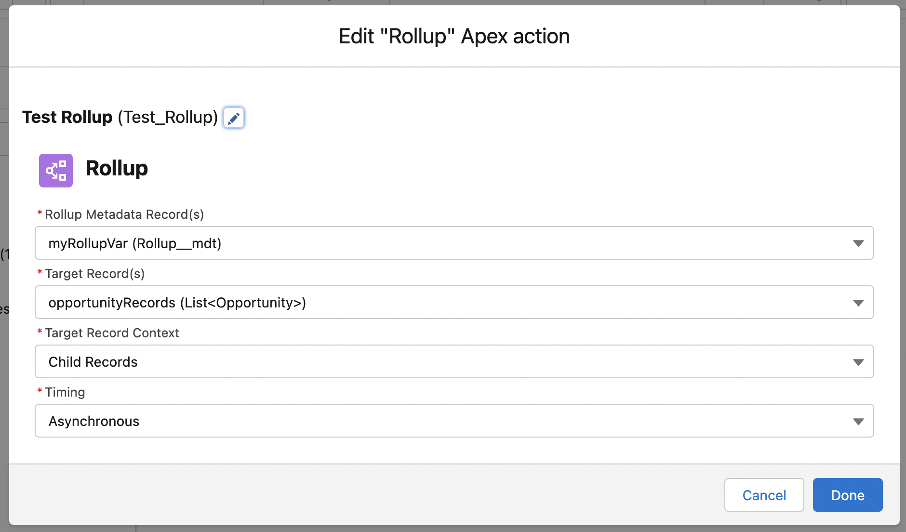
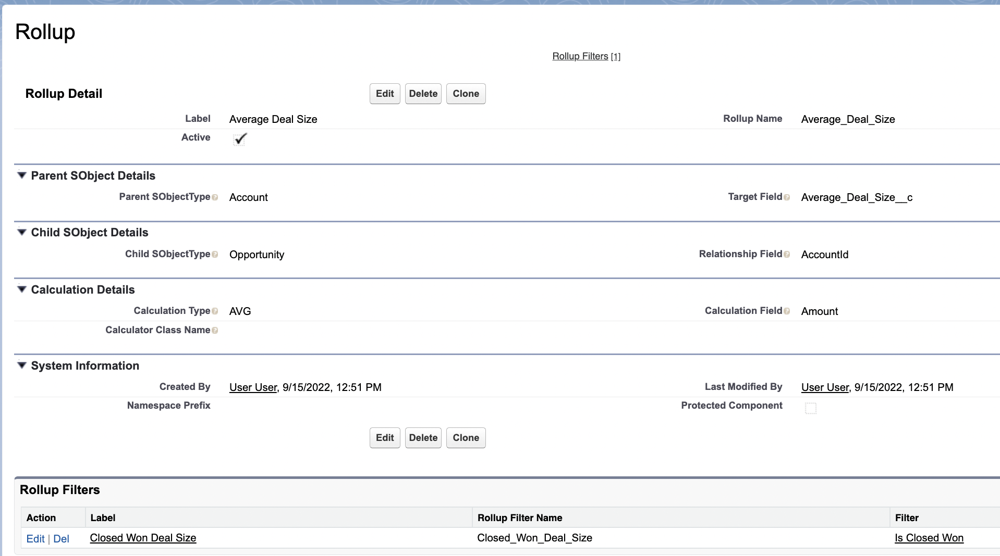
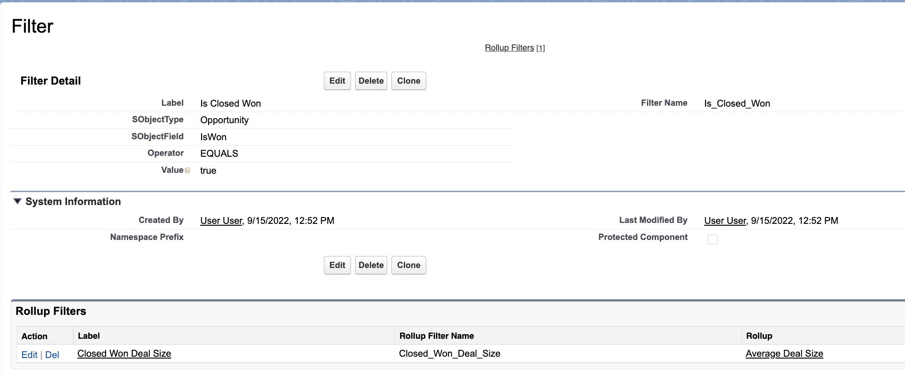
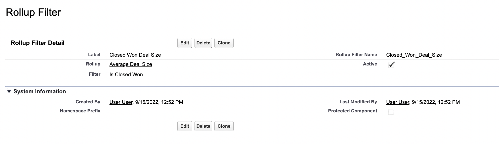

# Rollup

Rollup Summary fields are incredibly powerful for generating valuable business insights. Though "standard" Master-Detail rollups are somewhat limited, there's a number of tools on the AppExchange which empower admins to create their own custom rollups. Two of the most popular include [DLRS](https://github.com/SFDO-Community/declarative-lookup-rollup-summaries) and [Rollup Helper](https://www.passagetechnology.com/rollup-helper-overview).

Early on in my career, our team used [Rollup Helper](https://www.passagetechnology.com/rollup-helper-overview). Because it was _so easy_ to add, the business would request new fields almost weekly, for use in various reports. For example:

-   `Average_Review_Score__c`: Displays the average of the `Score__c` field from all `CSAT_Review__c` records related to a `Contact`.

Unfortunately, our abuse of this tool eventually caught up with us. Our organization became plagued with all sorts of performance issues, especially Apex CPU Timeout and Row-Locking errors. After a bit of log analysis, it wasn't too hard to find out the culprit.

We worked hard to untangle ourselves from the mess we had created - eliminating any non-critical Rollup operations. Inevitably, there were some operations that could not be removed. To uninstall the app, we eventually created our own Rollup methods in Apex. This way, we at least had control over execution.

These methods worked, but they were themselves were inflexible and repetitive. Implementing (and testing!) new Rollup fields took ages.

I've since left that company, but haven't stopped thinking about ways to solve this problem. Enter the `Rollup` framework. `Rollup` handles the common logic behind all Rollup operations. Better yet, it automatically bulkifies, and be configured to run in a variety of contexts.

Developers can use its fluent interface to construct infinitely complex operations using just a couple of lines of code. Admins can also construct new rollup operations using no code at all, with the included [Flow Action](#the-rollup-flow-action) and [Custom Metadata Type](#the-rollupmdt-custom-metadata-type).

## Contents

-   [Rollup Components](#creating-a-rollup)
    -   [The `Rollup` Class](#the-rollup-class)
    -   [The `Rollup.Relationship` Class](#the-rollup-relationship-class)
    -   [The `Rollup.Request` Class](#the-rollup-request-class)
    -   [The `Rollup.Calculator` Class](#the-rollup-calculator-class)
    -   [The `Filter` Class](#the-filter-class)
-   [Usage in Apex](#usage-in-apex)
-   [Usage in Flow](#usage-in-flow)
    -   [The `Rollup` Flow Action](#the-rollup-flow-action)
    -   [The `Rollup__mdt` Custom Metadata Type](#the-rollupmdt-custom-metadata-type)
    -   [The `InvocableRollup` Class](#the-invocable-rollup-class)
    -   [The `RollupMetadataHelper` Class](#the-rollup-metadata-helper-class)

## Rollup Components

### **The `Rollup` Class**

The `Rollup` class is the primary actor in the Rollup framework. A **Rollup** object represents Rollup operation(s) for a parent SObjectType. For example, all of these rollup operations on the `Account` would be reprsented by a single `Rollup` object:

-   `Account.First_Sale__c`: MIN of of `Opportunity.CloseDate` on all "Closed Won" Opportunities related to the Account.
-   `Account.Last_Correspondance__c`: MAX of `Task.CreatedDate` on all Tasks related to the Account.
-   `Account.Number_of_Open_Cases__c`: COUNT of open Cases related to the Account.
-   `Account.Total_Value__c`: SUM of `Opportunity.Amount` on all "Closed Won" Opportunities related to the Account.

The `Rollup` class accepts an `SObjectType` in the constructor. It has three public methods:

-   `Rollup addRelationship(Relationship relationship)`: Adds the relationship to the Rollup.
-   `List<SObject> run(Set<Id> targetRecordIds/List<SObject> records)`: Executes the Rollup against a list of target records. This involves calling the private `calcuate()` method on each `Rollup.Relationship`.
-   `List<SObject> runFromChild(List<SObject> childRecords, SObjectField lookupField)`: Finds the target SObjects via the provided lookup field, and then passes those records to the `run()` method.

This example reconstructs the above example as a `Rollup` object (`Rollup.Relationship` construction not shown - see [**The `Rollup.Relationship` Class**](#the-rolluprelationship-class) for more information).

```
Rollup myRoll = new Rollup(Account.SObjectType)
    .addRelationship(caseRelationship)
    .addRelationship(oppsRelationship)
    .addRelationship(taskrelationship);
List<Account> results = (List<Account>) myRoll.run(myAccs);
```

### **The `Rollup.Relationship` Class**

A `Rollup.Relationship` represents all Rollup operations between the `Rollup`'s target SObjectType and a specific Child SObjectType.

The `Rollup.Relationship` object can be constructed using either a `Schema.ChildRelationship` or a `Schema.SObjectField`:

```
// These objects are the same
Rollup.Relationship rel1 = new Rollup.Relationship(
    SchemaUtils.getChildRelationship(Opportunity.AccountId)
);
Rollup.Relationship rel2 = new Rollup.Relationship(
    Opportunity.AccountId
);
```

The `Rollup.Relationship` has just one public method:

-   `Rollup.Relationship addRequest(Rollup.Request request)`: Adds a the request to the `Rollup.Relationship`, and returns the current instance.

This example adds a basic request to the `Account.Opportunities` relationship:

```
Rollup.Relationship relationship = new Rollup.Relationship(
    Opportunity.AccountId
).addRequest(new Rollup.Request(
    Account.Last_Correspondance__c,
    new MaxCalculator().setCalcField(Task.CreatedDate)
));
```

### **The `Rollup.Request` Class**

The `Rollup.Request` represents a single rollup calculation. Here's an example of a single `Rollup.Request`, using our earlier example:

-   `Account.First_Sale__c`: MIN of of `Opportunity.CloseDate` on all "Closed Won" Opportunities related to the Account.

A `Rollup.Request` can be constructed with the following parameters:

-   `targetField`: A `SObjectField` on the target SObject that determines where the calculation results will be posted.
-   `calculator`: A `Rollup.Calculator` which defines the rollup operation. See [\*\*The `Rollup.Calculator` Class](#the-rollupcalculator-class) for more.
-   `filter`/`filters`: (optional) A `Filter` or `List<Filter>` that can be used to exclude certain records from the Rollup calculation. Read more about the `Filter` class [here](../DatabaseLayer/README.md/#the-filter-class).

This example `Rollup.Request` will calculate the MAX of `Opportunity.CloseDate` from all Opprotunities where `Opportunity.IsWon = true`. Results will be posted on the `Account.First_Sale__c` field.

```
Rollup.Request firstSale = new Rollup.Request(
    Account.First_Sale__c,
    new MinCalculator().setCalcField(Opportunity.CloseDate),
    new Filter(Opportunity.IsWon, Filter.EQUALS, true)
);
```

The `Rollup.Request` has just one public method:

-   `Rollup.Request addFilters(Filter filter/List<Filter> filters)`: Adds the `Filter` object(s) to the `Request`. Returns the current instance.

```
request = request.addFilters(
    new Filter(Opportunity.Amount, Filter.GREATER, 1000)
);
```

### **The `Rollup.Calculator` Class**

The `Rollup.Calculator` abstract class handles the calculation logic of a single Rollup operation.

A `Rollup.Calculator` cannot be directly constructed. You must construct an instance which extends it, like `SumCalculator`:

```
Rollup.Calculator calculator = new SumCalculator();
```

The `Rollup.Calculator` has three public methods:

-   `FieldRef getCalcField()`: returns the current `calcField`.
-   `Calculator setCalcField(SObjectField field/FieldRef fieldReference)`: Sets the current `calcField`, and returns the current instance. Callers can provide an `SObjectField` for simple field references, or a `FieldRef` object to refer to parent or grandparent fields on the target record.
-   `Object calculate(List<SObject> records)`: Run the calculation against a group of records, and returns the calculated value.

#### **Custom Calculators**

`Rollup` ships with the five most common calculation methods out of the box:

-   `AvgCalculator`
-   `CountCalculator`
-   `MaxCalculator`
-   `MinCalculator`
-   `SumCalculator`

However, the `Rollup.Calculator` class can be extended to suit your own custom calculation logic. When building your own custom type, you may override any of these virtual methods:

-   `Calculator setCalcField(SObjectField field)`: Default implementation sets the current `calcField`, and returns the current instance. Nearly all `Calculator` objects will use the default implementation. However, The `CountCalculator` does not, since a `calcField` is not needed to count the number of records.
-   `Object calculate(List<SObject> records)`: Default implementation runs the calculation against a group of records, and returns the calculated value.
-   `Boolean calculateBoolean(List<SObject> records)`: A sub-method called by `calculate()` when the `calcField` is a `Boolean` value.
-   `Date calculateDate(List<SObject> records)`: A sub-method called by `calculate()` when the `calcField` is a `Date` value.
-   `DateTime calculateDateTime(List<SObject> records)`: A sub-method called by `calculate()` when the `calcField` is a `DateTime` value.
-   `Decimal calculateNumber(List<SObject> records)`: A sub-method called by `calculate()` when the `calcField` is an `Integer`/`Decimal` value.
-   `String calculateText(List<SObject> records)`: A sub-method called by `calculate()` when the `calcField` is a `String` value.

Here is an example of a custom `Rollup.Calculator`, which calculates the "reverse-sum" from the given `calcField`:

```
public class ReverseSumCalculator extends Rollup.Calculator {
    // Returns the SUM of Positive Numbers as a negative
    public override Decimal calculateNumber(List<SObject> records) {
        Decimal sum = 0;
        for (SObject record : records) {
            SObjectField calcField = this.getCalcField?.toSchemaType();
            Decimal recordValue = (Decimal) record?.get(calcField);
            Decimal sumValue = (recordValue != null) ? recordValue : 0;
            sum -= sumValue;
        }
        return sum;
    }
}
```

```
Rollup.Request moneyLost = new Rollup.Request(
    Account.Money_Lost__c,
    new ReverseSumCalculator().setCalcField(Opportunity.Amount),
    new Filter(Opportunity.IsLost, Filter.EQUALS, true)
);
```

### **The `Filter` Class**

The `Filter` class was originally designed for use in `Soql`, but it has its own built-in methods to determine if SObjects meet its defined criteria:

```
Filter filter = new Filter(
    Account.Name,
    Filter.CONTAINS,
    'Test'
);
Account account = new Account(Name = 'My Test Account');
Boolean isTest = filter.meetsCriteria(account);
// > true
```

In `Rollup`, `Filter`s are used as part of the `Rollup.Request` class to remove certain records from the calculation.

In this example, a `Filter` is applied to ensure that only "Closed Won" Opportunities are summed:

```
Rollup.Request totalValue = new Rollup.Request(
    Account.Total_Value__c,
    new SumCalculator().setCalcField(Opportunity.Amount),
    new Filter(Opportunity.IsWon, Filter.EQUALS, true)
);
```

You can read more about the `Filter` class [here](../DatabaseLayer/README.md/#the-filter-class);

## Usage in Apex

`Rollup` objects can be constructed using a fluent interface pattern. This provides developers with maximum flexibility when defining rollup logic:

```
Rollup.Relationship opps = new Rollup.Relationship(Opportunity.AccountId)
    .addRequest(new Rollup.Request(
        Account.Num_Opps__c,
        new CountCalculator()
    ))
    .addRequest(new Rollup.Request(
        Account.Closed_Amount__c,
        new SumCalculator().setCalcField(Opportunity.Amount),
        new Filter(Opportunity.IsWon)
    ));
Rollup rollup = new Rollup().addRelationship(opps);
```

## Usage in Flow

### **The `Rollup` Flow Action**

The `Rollup` flow action allows Developers to execute Rollup operations from within Flows:



The flow action accepts the following parameters:

-   **`Rollup Metadata Record(s)`**: Accepts either a `Rollup__mdt` or `List<Rollup__mdt>` record(s) variable. The Rollup record(s) defines the rollup details. See [**The `Rollup__mdt` Custom Metadata Type**](#the-rollupmdt-custom-metadata-type) for more.
-   **`Target Record(s)`**: Accepts either a `SObject` or `List<SObject>` record(s) variable. This defines the records which will be fed to the rollup's `run()` method.
-   **`Target Record Context`**: Defines whether the provided `Target Record(s)` are the `Parent Records` or `Child Records` in the operation.
-   **`Timing`**: Defines when the Rollup will run; either `Asynchronous` via a Queueable, or `Synchronous`.

### **The `Rollup__mdt` Custom Metadata Type**

The `Rollup__mdt` defines rollup details for the `Rollup` flow action. It contains everything needed to run a standalone Rollup operation, including details from the `Rollup`, `Rollup.Relationship`, and `Rollup.Request` objects.

Once the flow is invoked, the `InvocableRollup` class constructs unified `Rollup` objects by passing all `Rollup__mdt` record(s) provided in the flow action's `Rollup Metadata Record(s)` to the the `RollupMetadataHelper` class.

The `RollupMetadataHelper` class will group `Rollup__mdt` records by their `Parent SObjectType`, and create a `Rollup` object for each. It will then create a `Rollup.Relationship` for each unique `Child SObjectType`/`Relationship Field` on each new Rollup object. Then it will create a `Rollup.Request` for each `Rollup__mdt` in the correct `Rollup.Relationship`.

Here is an example of a `Rollup__mdt` record:



-   `Active`: (Checkbox) Determines whether the current record should be added to Rollups.
-   `Parent SObjectType`: (Text) The API name of Parent SObjectType for the rollup operation.
-   `Target_Field__c`: (Text) The API name of the SObjectField on the Parent SObject where calculation results will be posted.
-   `Child SObjectType`: (Text) The API name of the Child SObjectType for the rollup operation.
-   `Relationship Field`: (Text) The API name of the lookup field on the Child SObjectType that points to the Parent SObjectType for the rollup operation.
-   `Calculation Type`: (Picklist) Describes the Calculation object which will be used in the Rollup operation. For example, `AVG` maps to the `AvgCalculator` object. Not required when using a custom calculator.
-   `Calculator Class Name`: (Text) The Apex Class Name of the custom calculator class (if used). Not required when using a standard calculator.
-   `Calculation Field`: (Text) The SObjectField on the Child SObjectType used to calculate the rollup results. Not required in `COUNT` operations.

> **Note:** Why are all of these SObjectType/SObjectField references expressed in `Text` fields? Though Custom Metadata Types provides Entity Definition, Field Definition, and Entity Particle fields as a more type-safe option, these fields have a glaring [**known issue**](https://github.com/jasonsiders/apex-starter-pack/issues/90) that prevents them from being used with Custom SObjectTypes and Custom Fields.

### **The `Filter__mdt` Custom Metadata Type**

The `Filter__mdt` custom metadata type represents a `Filter` object which can be applied to rollups in flow. The `Filter__mdt` itself is not directly related to a single `Rollup__mdt`, but rather through the `Rollup_Filter__mdt` junction object. This allows for a `Filter__mdt` to be reused on many `Rollup__mdt` if desired.

Here is an example `Filter__mdt` record:



-   `SObjectType`:(Text) Defines the `SObjectType` of the `SObjectField`
-   `SObjectField`: (Text) The field used in the left-hand side of the `Filter` equation (ex., "**Amount** > 1000")
-   `Operator`: (Picklist) Defines the operand used in the `Filter` equation (ex., "Amount **>** 1000")
-   `Value`: (Text) Defines the right-hand side of the `Filter` equation (ex., "Amount > **1000**")

**Note**: Salesforce does not have a "generic object" field data type. Rather than defining a `Value` field for every data type (ie., `Checkbox Value`, `Date Value`, `Number Value`, etc.), developers can imagine the `Value` field as text which could plug into a JSON-serialized representation of a `Filter` object:

```
{
    "fieldName": {!SObjectField},
    "operator": {!Operator}
    "value": {!Value}
}
```

This means that developers should be careful to apply the correct format, depending on the data type:

-   `Boolean`: Not enclosed in quotes, and value must be `true` or `false`.
    -   Example: `true`
-   `Date`: Enclosed in quotes, and expressed in ISO 8601 format.
    -   Example: `"2000-01-01"`
-   `DateTime`: Enclosed in quotes, and expressed in ISO 8601 format.
    -   Example: `"2000-01-01T00:00:00Z"`
-   `Number`: Not enclosed in quotes.
    -   Example: `10.99`, `100`
-   `String`:
    -   Example: `"Hello World!"`

### **The `Rollup_Filter__mdt` Custom Metadata Type**

This type is a junction object between `Rollup__mdt` and `Filter__mdt`. It allows for many-to-many relationships between these two objects.

Here is an example `Rollup_Filter__mdt` record:



-   `Rollup`: The linked `Rollup__mdt` record
-   `Filter`: The linked `Filter__mdt` record
-   `Active`: Defines whether the `Filter` will be enforced on the `Rollup`.
